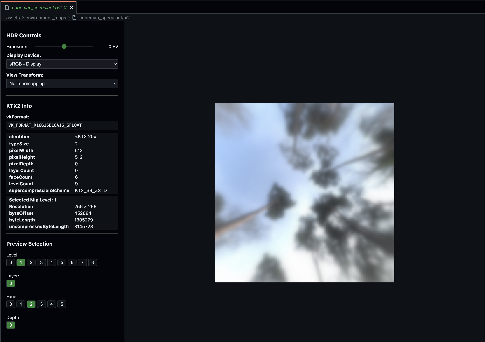

# EXR and KTX Preview for VSCode

This VSCode extension allows you to preview EXR (OpenEXR) and KTX (Khronos Texture) images directly in VSCode using OpenImageIO's command line tools.

## Prerequisites

- [VSCode](https://code.visualstudio.com/) or [Cursor](https://www.cursor.com/)
- [OpenImageIO](https://github.com/OpenImageIO/oiio) installed with command line tools
- [KTX-Software](https://github.com/KhronosGroup/KTX-Software/releases) installed with command line tools

## Installation

1. Clone this repository
2. Run `pnpm install` to install dependencies
3. Run `pnpm compile` to build the extension
4. Press F5 in VSCode to start debugging and test the extension

Can be installed from the marketplace as well: https://marketplace.visualstudio.com/items?itemName=mate-h.exr-preview

## Usage

1. Open an EXR or KTX file in VSCode
2. The file will automatically open in the EXR or KTX Preview editor
3. The preview will be generated using OpenImageIO and displayed in VSCode

## Features

- Automatic preview generation for EXR and KTX files
- Clean and simple interface
- Uses OpenImageIO for high-quality previews

## Requirements

- VSCode 1.60.0 or higher
- OpenImageIO installed and available in system PATH

## Known Issues

- The preview is generated as a temporary PNG file and then displayed
- Large EXR files might take a moment to generate the preview

## Contributing

Feel free to open issues or submit pull requests for any improvements.

## License

MIT
